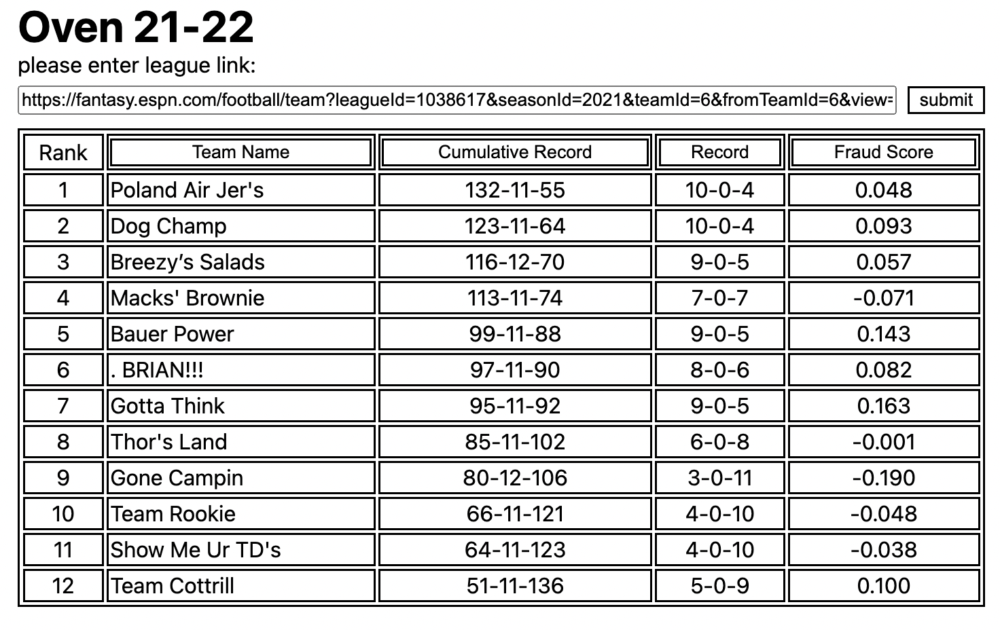

# ffanalyzer: a tool to import and view league data from espn fantasy football leagues

### how it works

* user enters espn fantasy league link(link must contain league id, but any link to a page within the fantasy league will include that)
* api call is made and data is imported
* standings are put into interactive table using different record metrics
* user can change ranking based on different parameters

### stats explained

* record: standard record imported directly from espn. win-losses-draws for all head to head matchups   
* cumulative record: this is a teams record if they played every team in the league every week. the goal of this stat is to reduce matchup based luck. you must consistently perform above the league average in order to have a winning record
* fraud score: difference in cumulative and standard record, or cumulative winning percentage minus standard winning percentage. meant to show which teams benefit from lucky or easy matchups. a negative score is considered unlucky, while a positive score is lucky.

### future updates

* dropdown box to select which week's standings to view

### about

* made by will shuttleworth. thank you to league mates for help with testing. more features coming for 2022 season

